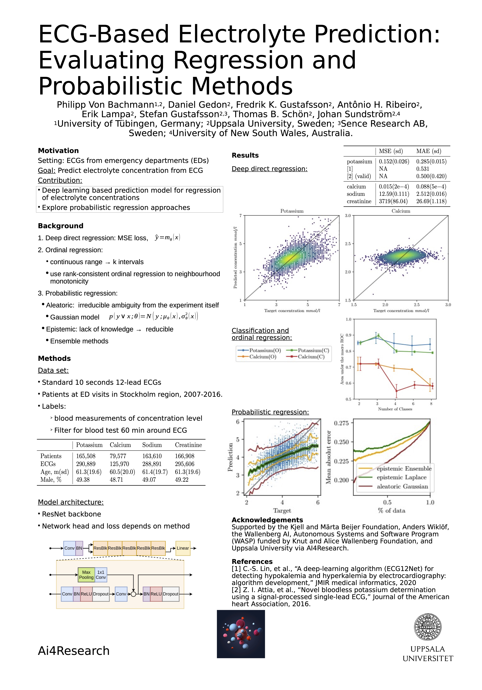

# Electrocardiogram based electrolyte concentration prediction
Codebase for the paper "ECG-Based Electrolyte Prediction: Evaluating
Regression and Probabilistic Methods".

# Overview
Here is a quick overview of the paper
<p style="text-align:center;">

<p>

# Dataset
Unfortunately, our dataset is not publicly available. However you can implement your own dataset. In order to do this, please overwrite the method ```load_dset_electrolyte``` [here](src/dataset/electolytes.py). You can overwrite the whole method or alternatively change
- Loading of the ECG traces in line 62 - 66 (traces are given as ```datapoints x leads x samples```)
- Loading of the metadata in line 61, which needs to contain
  - A column whose name is given by the input argument ```el_col```, which contains the electrolyte concentration.
  - A column named "split", specifying the split of the individual datapoints.
  - Additionally, columns named "ecg_age" and "is_male", to enable the use of this metadata, or alternatively disable these functionalities.

# Training and Evaluating
A minimal example to train a model is
```
python experiments/training/train.py --folder OUTPUT_FOLDER --m MODEL_CONFIG --d DSET_CONFIG
```
which trains a regression model. ```MODEL_CONFIG``` is a json file which will be passed to the model constructor, an example can be found [here](additional/model.json), otherwise look in [this](src/models/resnet.py) file for the model constructors and their respective arguments. ```DSET_CONFIG``` is a json file as well, which specifies arguments passed to your modified dataset constructor.


 The behaviour can be furter customized by adding specifying more arguments. The main ones are:
- ```--task``` changes on which task to train the model, options are "regression", "classification", "ordinal", "gaussian".
- ```--buckets``` if task is "classification" or "ordinal", uses these intervals to discretize the targets, should be passed as list of floats.
- ```--epochs``` change the number of epochs.

All additional arguments with descriptions can be retrieved by executing 
```
python experiments/training/train.py --help
```

In order to evaluate a model, run
```
python experiments/evaluation/forward.py --model PATH_TO_MODEL --splits LIST_OF_SPLITS
```
where the ```LIST_OF_SPLITS``` are the dataset splits you defined when overwriting the method ```load_dset_electrolyte```. This creates a csv file containing the predictions and targets which can then be evaluated.

# Pretrained models
We release our pretrained models [here](https://zenodo.org/record/7456316#.Y6CHPS8w1qs) which can be used to try on your own models. Each model folder contains the state_dict of the model, for a tutorial see [Loading and saving models in PyTorch](https://pytorch.org/tutorials/beginner/saving_loading_models.html), as well as the config used during training.

